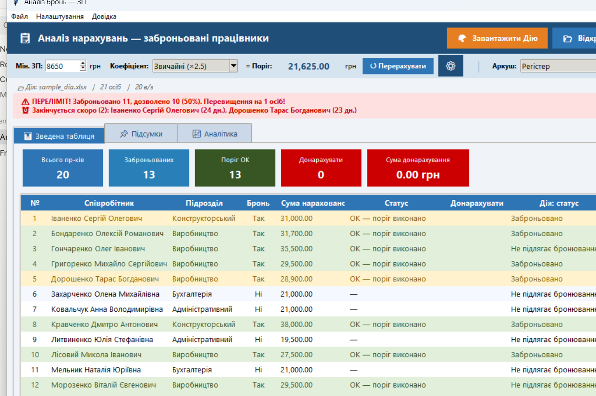
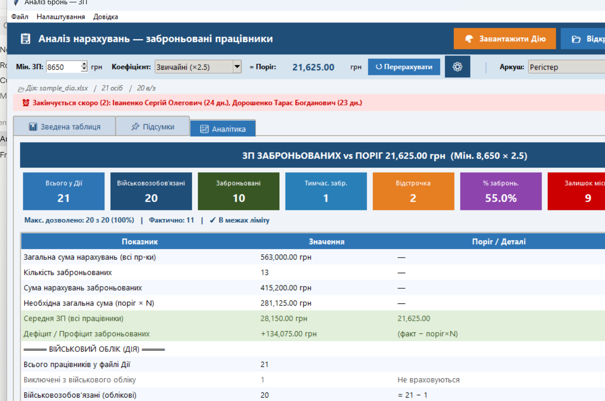
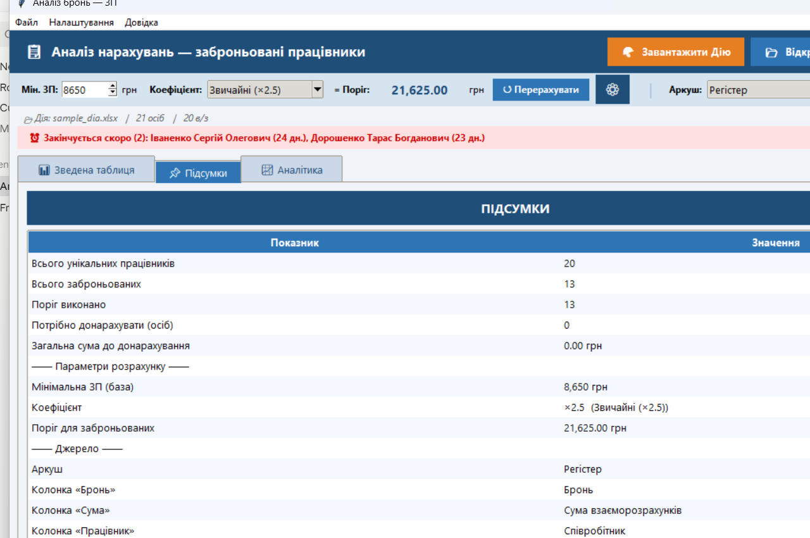
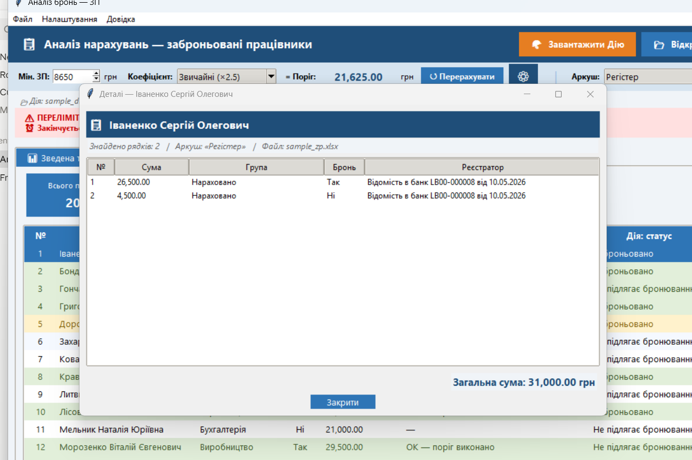
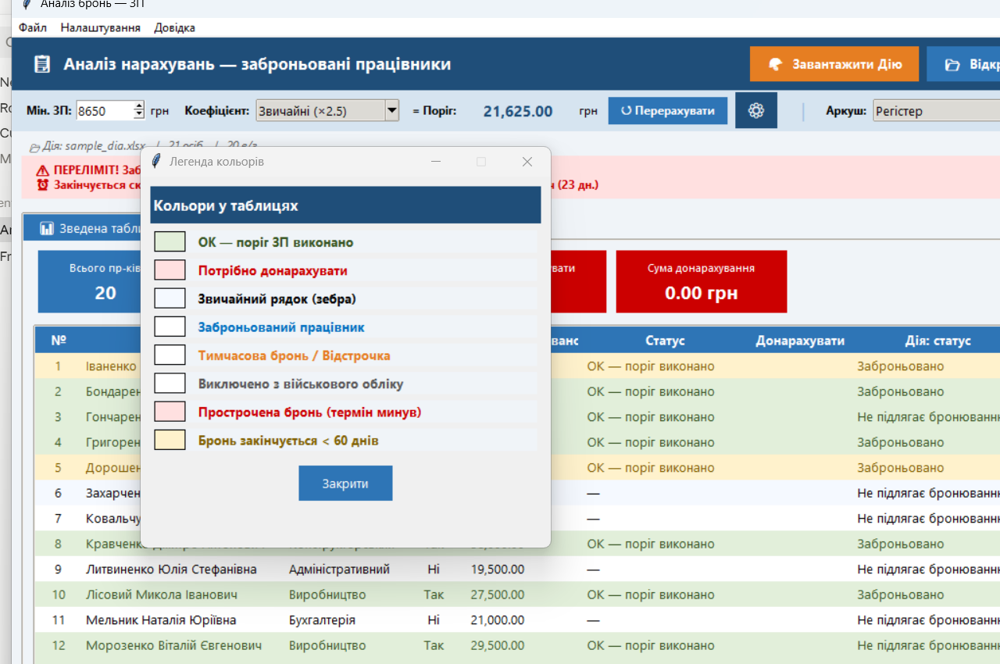

# 📋 Аналіз броньювання — ЗП

[](https://www.gnu.org/licenses/gpl-3.0)
[](https://www.python.org/)
[](https://github.com/r0665629590-droid/bron-analysis)
[](https://github.com/r0665629590-droid/bron-analysis)
[](https://github.com/r0665629590-droid/bron-analysis/discussions)
[](https://github.com/r0665629590-droid/bron-analysis/issues)
[](https://github.com/r0665629590-droid/bron-analysis/stargazers)

Десктопна програма (Python/Tkinter) для бухгалтерів та кадровиків в Україні.
Перевіряє відповідність нарахованої зарплати **заброньованих працівників** мінімальному порогу,
контролює **ліміт бронювання** та аналізує **військовий облік** на підставі вигрузки з **Дії**.

---

## 📸 Скріншоти

### Зведена таблиця — ЗП + Дія об'єднано по працівнику


> Кольорове підсвічування: ⚠️ червоний — потрібно донарахувати або прострочена бронь, 🟨 жовтий — бронь закінчується < 60 днів, 🟧 оранжевий — лише в Дії, 🟩 зелений — поріг виконано.

### Аналітика — повна картина по бронюванню та військовому обліку


> Картки: всього у Дії, військовозобовʼязані, заброньовані постійно/тимчасово, відстрочка, %, залишок місць. Внизу — деталізована таблиця: структура, ліміт, строки, перехрест ЗП ↔ Дія.

### Підсумки


### Деталі працівника (подвійний клік на рядку)


> Показує всі вхідні рядки з регістра ЗП — окремо зарплата, відпускні, лікарняні — і загальну суму.

### Легенда кольорів


---

## 🎯 Для кого

- **Бухгалтер** — швидко знайти кому потрібно донарахувати ЗП, щоб відповідати порогу
- **Кадровик / HR** — контролювати ліміт бронювання, строки закінчення
- **Керівник** — отримати загальну картину по військовому обліку

---

## ✨ Можливості

### 📊 Аналіз ЗП
- Підтримка **двох форматів** xlsx (з різних бухгалтерських програм, авто-визначення колонок)
- Вибір потрібного аркуша
- Мін. ЗП (за замовч. 8 647 грн) × коефіцієнт = поріг
- Декілька **коефіцієнтів** (×2.5 звичайні, ×4.0 медики — можна додавати свої)
- Розрахунок порогу та сум до донарахування
- **Автоочистка дат** від `00:00:00` (БАС часто експортує `01.05.2026 00:00:00`)

### 🪖 Інтеграція з файлом «Дія»
- Завантаження вигрузки з Реєстру військовозобов'язаних
- Підтримка форматів з **2 та 3 аркушами** (постійно/тимчасово заброньовані)
- Виключення з аналізу аркуша «Кінцеві бенефіціарні власники»
- Виключення працівників зі статусом «Виключено з військового обліку»

### 📈 Аналітика
- Структура персоналу (всього / в/з / заброньовані / тимчасово / відстрочка)
- **Ліміт бронювання** (50 % / 75 % / 100 % або довільний)
- Контроль переліміту з ⚠ попередженнями
- **Строки бронювання** — найближчий та найпізніший термін
- ⏰ Попередження про **прострочену** бронь та **закінчення < 60 днів**
- **Перехресна перевірка ЗП ↔ Дія** — хто є в одному джерелі, але не в іншому
- Перевірка ЗП порогу для заброньованих з Дії

### 🔍 Зручність
- Об'єднана зведена таблиця **ЗП + Дія по працівнику**
- Сортування за будь-яким стовпцем (клік на заголовок ▲/▼)
- Фільтри: Бронь, Статус, Підрозділ, Дія-статус, Тип броні
- Текстовий пошук
- **Експорт CSV** з кожної таблиці
- Збереження результату в окремий аркуш «Аналіз бронь»
- **Меню «Файл»** з нещодавніми файлами (10 останніх ЗП + Дії)
- **Авто-завантаження** останнього файлу Дії при старті
- **Подвійний клік** на рядку → деталі працівника (всі вхідні рядки)
- **Правий клік** → копіювати клітинку / рядок / всі видимі рядки
- **Підсвічування** прострочених бронь (червоним) та закінчуючих (жовтим)
- **Легенда кольорів** — внизу таблиці та в меню «Довідка»

### ⌨️ Гарячі клавіші
| Клавіша | Дія |
|---------|-----|
| `Ctrl+O` | Відкрити файл ЗП |
| `Ctrl+D` | Відкрити файл Дії |
| `Ctrl+S` | Зберегти в Excel |
| `Ctrl+E` | Експорт CSV |
| `Ctrl+F` | Пошук |
| `F5` | Перерахувати |
| `Ctrl+Q` | Вийти |

---

## 📥 Як отримати вхідні файли

### 1️⃣ Файл ЗП — з БАС / 1С (Регістр бухгалтерії)

В програмі **БАС Бухгалтерія / 1С** відкрийте:
**Регістри → Регістр накопичення «Взаєморозрахунки зі співробітниками»**

1. Встановіть період: **за 1 місяць** (наприклад, з 01.05.2026 по 31.05.2026)
2. Зніміть зайві фільтри
3. **Вигрузіть → у Excel (.xlsx)**

Приклад файлу — **`sample_zp.xlsx`** (у цьому репозиторії), з фейковими ПІБ.

> 💡 **Дати з `00:00:00`** — програма автоматично очищає їх при збереженні.

#### Структура файлу:

| Період | Реєстратор | Фізична особа | Підрозділ | Сума взаєморозрахунків | Група нарахування | Бронь |
|--------|-----------|---------------|-----------|------------------------|-------------------|-------|
| 01.05.2026 | Відомість LB00-… | Шевченко Т.Г. | Адміністративний | 33 500,00 | Нараховано | Так |

### 2️⃣ Файл Дії — з порталу «Дія для бізнесу»

1. Зайдіть на портал **diia.gov.ua** під ключем ЄЦП
2. **Бізнес → Військовий облік → Реєстр військовозобов'язаних**
3. Вигрузіть «Відомості з Реєстру про працівників» у **.xlsx**

Файл містить аркуші:
- «Інформація про працівників» (основний)
- «Інформація про працівників із …» (тимчасово заброньовані — опціонально)
- «Кінцеві бенефіціарні власники» (програма пропускає автоматично)

---

## 🚀 Встановлення на новому ПК

1. Скопіюйте всю папку проекту
2. Двічі клікніть **`install.bat`**
   - Встановить Python 3.12 (через winget або з python.org)
   - Встановить залежність `openpyxl`
   - Створить ярлик на робочому столі
3. Якщо встановлювався Python — запустіть `install.bat` ще раз
   (для оновлення PATH)

## ▶️ Запуск
- Двічі клікніть **`run.bat`**
- Або через ярлик «Аналіз броньювання» на робочому столі

---

## 📁 Структура проекту

| Файл | Опис |
|------|------|
| `bron_analysis_all.py` | Основна програма (Tkinter GUI) |
| `bron_settings.json` | Налаштування (мін. ЗП, коефіцієнти, ліміт) |
| `sample_zp.xlsx` | Приклад вхідного файлу ЗП (фейкові ПІБ) |
| `requirements.txt` | Залежності Python |
| `install.bat` | Автоматичний установник |
| `run.bat` | Запуск без консолі |
| `README.md` | Цей файл |

---

## ⚙️ Налаштування

`bron_settings.json`:

```json
{
  "min_salary": 8647,
  "coefficients": [
    { "name": "Звичайні (×2.5)", "value": 2.5 },
    { "name": "Медики (×4.0)",   "value": 4.0 }
  ],
  "bron_limit_pct": 50
}
```

Усе редагується через інтерфейс (⚙ кнопка налаштувань + поля в тулбарі).

---

## 📸 Робочий процес

```
  ┌─────────────────┐    ┌─────────────────┐
  │  xlsx з БАС     │    │  xlsx з Дії     │
  │  (ЗП за міс.)   │    │  (військ. обл.) │
  └────────┬────────┘    └────────┬────────┘
           │                      │
           ▼                      ▼
  ┌────────────────────────────────────────┐
  │     Аналіз броньювання — ЗП            │
  │  ┌─────────────────────────────────┐   │
  │  │ 📊 Зведена таблиця              │   │
  │  │   об'єднані дані по працівнику  │   │
  │  ├─────────────────────────────────┤   │
  │  │ 📌 Підсумки                     │   │
  │  ├─────────────────────────────────┤   │
  │  │ 📈 Аналітика                    │   │
  │  │   ЗП + Дія + ліміт + строки     │   │
  │  └─────────────────────────────────┘   │
  └─────────────────┬──────────────────────┘
                    │
                    ▼
  ┌────────────────────────────────────────┐
  │  ✓ Excel-звіт (новий аркуш)            │
  │  ✓ CSV-експорт                         │
  │  ✓ Дати очищено                        │
  └────────────────────────────────────────┘
```

---

## 🛠 Вимоги

- Windows 10/11
- Python 3.10+ (встановлюється автоматично)
- `openpyxl` ≥ 3.1
- `tkinter` (входить до Python)

---

## 💬 Спільнота

- 🙏 **Маєте питання?** → [Discussions: Q&A](https://github.com/r0665629590-droid/bron-analysis/discussions/categories/q-a)
- 💡 **Є ідея?** → [Discussions: Ideas](https://github.com/r0665629590-droid/bron-analysis/discussions/categories/ideas)
- 🐛 **Знайшли помилку?** → [Створити Issue](https://github.com/r0665629590-droid/bron-analysis/issues/new?template=bug_report.yml)
- ✨ **Пропозиція фічі?** → [Створити Feature Request](https://github.com/r0665629590-droid/bron-analysis/issues/new?template=feature_request.yml)
- 🙌 **Хочете поділитись досвідом?** → [Show and tell](https://github.com/r0665629590-droid/bron-analysis/discussions/categories/show-and-tell)

---

## 🆕 Зміни

- **v5 (поточна)** — меню, гарячі клавіші, нещодавні файли, авто-завантаження Дії, деталі працівника по подвійному кліку, копіювання правим кліком, підсвічування прострочених бронь, легенда кольорів
- **v4** — об'єднана таблиця ЗП+Дія, ліміт бронювання, перехресна перевірка, експорт CSV, автоочистка дат від `00:00:00`
- **v3** — інтеграція з Дією, аналітика військового обліку
- **v2** — підтримка 2 форматів xlsx, налаштування коефіцієнтів
- **v1** — базовий аналіз ЗП заброньованих

---

## 📜 Ліцензія

Цей проект розповсюджується під ліцензією **[GNU General Public License v3.0](LICENSE)**.

**Що це означає для вас:**
- ✅ Можете **використовувати** безкоштовно (особисто, у компанії, у бухгалтерії)
- ✅ Можете **модифікувати** під свої потреби
- ✅ Можете **поширювати** (з тією ж ліцензією)
- ⚠️ Якщо поширюєте модифікації — **вихідний код модифікацій теж має бути відкритий** під GPL v3
- ⚠️ Жодних гарантій — програма надається «як є»

### 💼 Комерційне використання без обмежень GPL

Якщо ви — компанія, що хоче інтегрувати код у **закрите/пропрієтарне ПЗ** без GPL-зобов'язань — звертайтесь за **комерційною ліцензією** через [GitHub Issues](https://github.com/r0665629590-droid/bron-analysis/issues) або профіль автора.

### 🤝 Хочете зробити внесок?

Дивіться [CONTRIBUTING.md](CONTRIBUTING.md) та [CLA.md](CLA.md) — для прийняття PR потрібна згода з Contributor License Agreement.

---

**Made with 💛💙 for Ukrainian accountants.**
